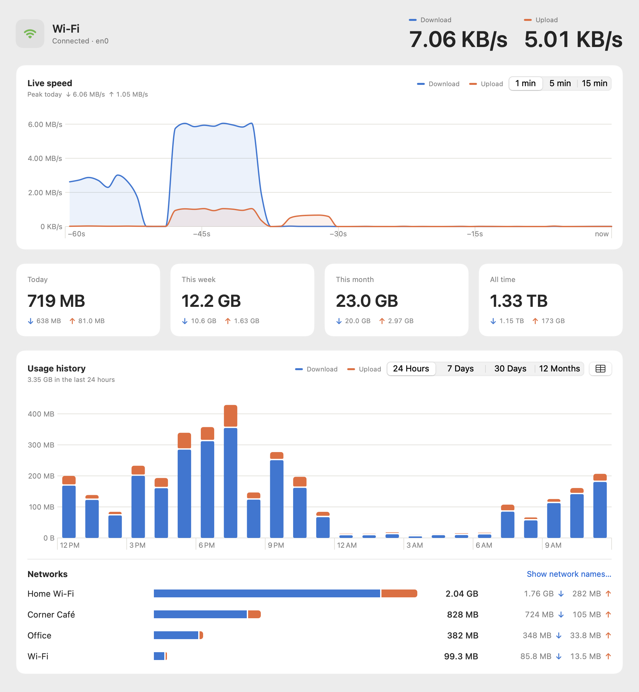

# WiFi Tracker

A tiny native macOS app that shows live Wi-Fi download and upload speeds in the menu bar and keeps a private, minute-by-minute history of your usage, split by network.

**[Download](https://github.com/darrenyoungblood12345-a11y/Wifi-Usage-tracker-Mac-os/releases/latest/download/WiFiTracker.dmg)** · **[Website](https://darrenyoungblood12345-a11y.github.io/Wifi-Usage-tracker-Mac-os/)** · macOS 14 Sonoma or later · Apple silicon & Intel



## Features

- **Menu bar speeds**: ↓/↑ every second, in MB/s or Mbps (or a combined figure, or just an icon).
- **Dashboard**: a live chart (1/5/15 min), totals for today/week/month/all time, and a history chart for the last 24 hours, 7 days, 30 days or 12 months, with hover tooltips and a table view.
- **Per-network usage**: splits usage by Wi-Fi name. Optional: macOS only reveals the SSID to apps with Location access.
- **Accurate**: reads the kernel's 64-bit interface counters (the same source as `netstat -ib`). If you quit the app, it catches up on the traffic it missed when it next opens (same boot session).
- **Private**: no network calls and no account. History is in `~/Library/Application Support/WiFiTracker/usage.sqlite`, with Export CSV and Clear History in Settings.

## Install

1. Download `WiFiTracker.dmg`, open it, and drag **WiFi Tracker** to Applications.
2. The app is ad-hoc signed, not notarized, so macOS blocks the first launch. Open **System Settings → Privacy & Security** and click **Open Anyway**, or run:

   ```bash
   xattr -dr com.apple.quarantine "/Applications/WiFi Tracker.app"
   ```

## Build from source

Requires Xcode 16+ (Swift 6). Everything is driven by scripts, and you can also open `app/Package.swift` in Xcode.

| Command | What it does |
|---|---|
| `scripts/test.sh` | Runs the core unit tests (Swift Testing). |
| `scripts/build-app.sh` | Universal release build → `~/Library/Caches/WiFiTracker-build/WiFi Tracker.app`, ad-hoc signed. Set `SIGN_IDENTITY` to sign with a Developer ID. |
| `scripts/build-dmg.sh` | Builds the app and packages `dist/WiFiTracker.dmg` (also copied to `landing/downloads/` for local preview). |
| `scripts/release.sh 1.1.0` | Bumps the version, pushes, builds the DMG and publishes a GitHub release. |
| `scripts/make-icon.sh` | Regenerates `AppIcon.icns` and the website icon from `scripts/make-icon.swift`. |

Build products live outside the project folder: iCloud-synced Desktop/Documents folders add extended attributes that break code signing.

### Website screenshots

`scripts/seed-demo-data.mjs` creates a sample database, and the app can render its own dashboard to a PNG, so no Screen Recording permission is needed:

```bash
node scripts/seed-demo-data.mjs /tmp/demo/usage.sqlite
WIFITRACKER_STORE=/tmp/demo/usage.sqlite WIFITRACKER_APPEARANCE=light WIFITRACKER_SNAPSHOT=/tmp/dashboard-light.png \
  "$HOME/Library/Caches/WiFiTracker-build/WiFi Tracker.app/Contents/MacOS/WiFiTracker" -onboardingDismissed YES -liveWindow 60
```

This writes `dashboard-light.png` and `dashboard-light.popover.png`, then quits.

## Project layout

```
app/
  Sources/WiFiTrackerCore/   counters (IFMIB sysctl), SQLite store, aggregation, formatting — no UI, unit tested
  Sources/WiFiTracker/       SwiftUI app: menu bar extra, dashboard, settings, Swift Charts
  Tests/                     Swift Testing suites
  Resources/                 Info.plist, entitlements, app icon
scripts/                     build, package, release and asset scripts
landing/                     static website (GitHub Pages via .github/workflows/pages.yml)
```

## Landing page

`landing/` is plain HTML/CSS/JS with no build step. Preview it locally with `python3 -m http.server 4173 --directory landing`. Pushing changes under `landing/` to `main` deploys it to GitHub Pages. The download button always points at the latest release's `WiFiTracker.dmg`.
